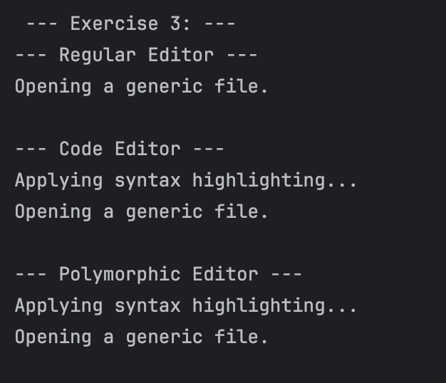
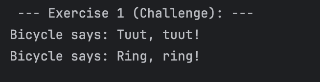
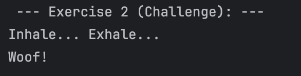
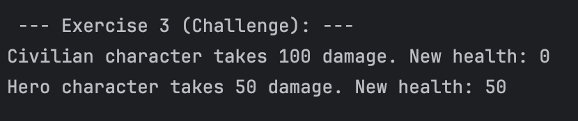

# Guided Java Lab: The Power of Inheritance

---

## Lazaro, Cade Virgil C.

---

### Exercise 1:

#### Prediction:
Tuut, tuut!  
I am a Generic Vehicle Mustang

#### Actual Output:

#### Explanation:
Child class Car can use the method honk() from 
its parent class Vehicle because it is an extension of it.

---

### Exercise 2:

#### Prediction:
The area is: 78.53981633974483  
The area is: 24.0

#### Actual Output:

#### Explanation:
Child classes that extends an abstract parent class
must override the abstract method of the parent. However,
if the child class is also an abstract class, it may opt not to
implement the abstract method of the parent class.

---

### Exercise 3:

#### Prediction:
--- Regular Editor ---  
Opening a generic file.

--- Code Editor --- 
Applying syntax highlighting... 
Opening a generic file.

--- Polymorphic Editor --- 
Applying syntax highlighting... 
Opening a generic file.

#### Actual Output:

#### Explanation:
Overriding a method from the parent class is generally allowed. In this
case, the child class CodeEditor overrode the method
openFile() of the parent class Editor, but it called the
method of the super class again using super.openFile() so the
output will have both from the parent and the class method.

---

### Exercise 4:

#### Actual Output:

#### Explanation:
The code will not compile because the parent class assigned
a private access modifier to the variable "balance". In order to
access the variable, we must use its public getter. Only then, the variable
will be available for use.

---

## Mini Challenges:

---

---

---

---

